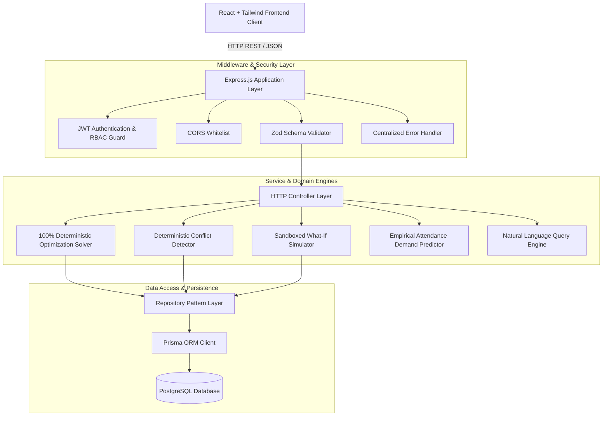
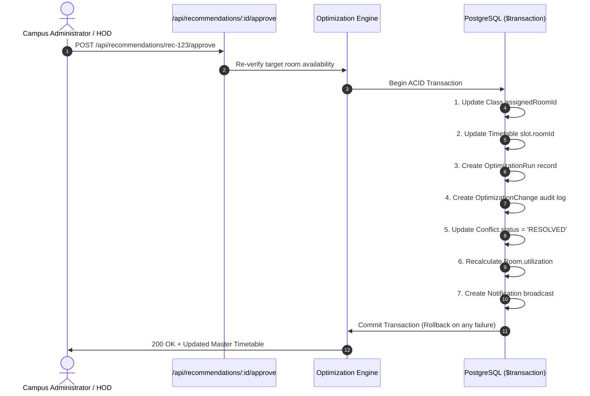

# 🏛️ CampusOptiX Architecture & Engineering Blueprint

This document details the system architecture, mathematical optimization models, data flow pipelines, security framework, and database design of **CampusOptiX**.

---

## 1. System Layer Diagram



---

## 2. Deterministic Conflict Detection Engine (Hard Constraints)

CampusOptiX uses a deterministic rule engine to ensure zero hallucinations for physical constraints:

1. **CAPACITY**:
   $$\text{studentCount} > \text{room.capacity} \implies \text{CAPACITY Conflict}$$
2. **ROOM_TIME Collision**:
   $$(\text{slot}_A.\text{day} = \text{slot}_B.\text{day}) \land (\text{slot}_A.\text{start} < \text{slot}_B.\text{end}) \land (\text{slot}_A.\text{end} > \text{slot}_B.\text{start}) \implies \text{ROOM\_TIME Collision}$$
3. **FACULTY_TIME Collision**:
   Double booking for instructor during overlapping time windows.
4. **EQUIPMENT Constraint**:
   Mandatory class hardware missing from candidate venue.
5. **ROOM_TYPE Mismatch**:
   Class requires specialized facility (e.g. `COMPUTER_LAB`) but assigned standard `CLASSROOM`.
6. **RESOURCE_UNAVAILABLE**:
   Room status is `MAINTENANCE` or `RESERVED`.

---

## 3. Multi-Objective Optimization Scoring (100 Points Total)

Candidates that pass all 6 hard constraints are evaluated against a transparent 7-criteria soft scoring matrix:

| Criterion | Max Points | Evaluation Function |
| :--- | :---: | :--- |
| **Capacity Suitability** | **25 pts** | $10\%–35\%$ buffer = $25\text{ pts}$; excess capacity scored proportionally |
| **Equipment Fulfillment** | **20 pts** | Ratio of required equipment installed in room |
| **Room Availability** | **20 pts** | Free at requested slot with 0 schedule overlaps |
| **Room Type Match** | **15 pts** | Exact facility type match |
| **Space Utilization** | **10 pts** | Target $60\%–90\%$ utilization balance |
| **Faculty Preference** | **5 pts** | Matches instructor preferred building & time |
| **Student Travel Distance** | **5 pts** | Haversine spherical distance between consecutive buildings |

---

## 4. Student Walking Distance (Haversine Formula)

Great-circle distance calculated between building GPS coordinates $(\phi_1, \lambda_1)$ and $(\phi_2, \lambda_2)$:
$$a = \sin^2\left(\frac{\Delta\phi}{2}\right) + \cos(\phi_1)\cos(\phi_2)\sin^2\left(\frac{\Delta\lambda}{2}\right)$$
$$d = 2R \cdot \text{atan2}\left(\sqrt{a}, \sqrt{1-a}\right) \quad (\text{where } R = 6,371,000\text{m})$$

- **$0\text{m}$ (Same Building)**: $5/5$ points ($100\%$)
- **$\le 100\text{m}$**: $4.5/5$ points ($90\%$)
- **$\le 250\text{m}$**: $3.5/5$ points ($70\%$)
- **$\le 500\text{m}$**: $2.5/5$ points ($50\%$)
- **Missing Location Data**: Neutral full score ($5/5$)

---

## 5. ACID Transaction Approval Pipeline



---

## 6. Directory Layout

```
CampusOptiX/
├── server/
│   ├── prisma/
│   │   ├── schema.prisma        # Database models & indexes
│   │   └── seed.ts              # 8 Demo scenarios & demo seed
│   ├── src/
│   │   ├── ai/                  # Natural Language Query Engine
│   │   ├── analytics/           # Campus KPI Analytics Engine
│   │   ├── controllers/         # HTTP REST Controllers
│   │   ├── docs/                # OpenAPI 3.0 & Swagger UI
│   │   ├── middleware/          # Auth (JWT), RBAC, Validation & Error
│   │   ├── optimization/        # Conflict Detector & Optimizer Engine
│   │   ├── repositories/        # Database Data Access Objects
│   │   ├── routes/              # Express API Routers
│   │   ├── services/            # Business Logic Layer
│   │   ├── simulation/          # Sandboxed What-If Simulator
│   │   ├── utils/               # Structured API Responses
│   │   ├── validators/          # Zod Validation Schemas
│   │   ├── app.ts               # Express App Setup
│   │   └── server.ts            # Entrypoint
│   └── tests/                   # Automated Unit & Integration Tests
├── src/                         # React Frontend Application
├── README.md                    # Project Overview
├── ARCHITECTURE.md              # Technical System Architecture
├── SETUP.md                     # Installation & Setup Guide
└── API.md                       # REST API Documentation
```
